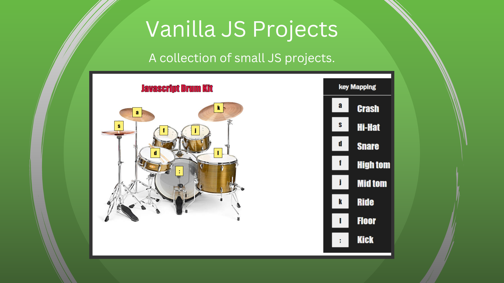
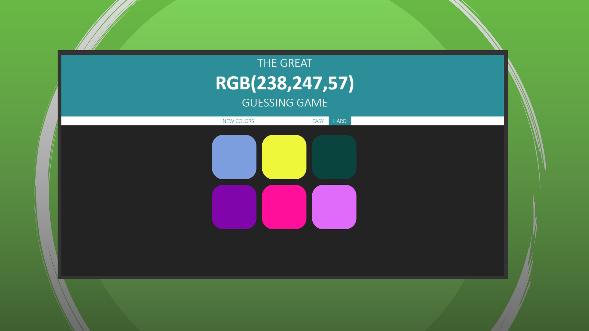
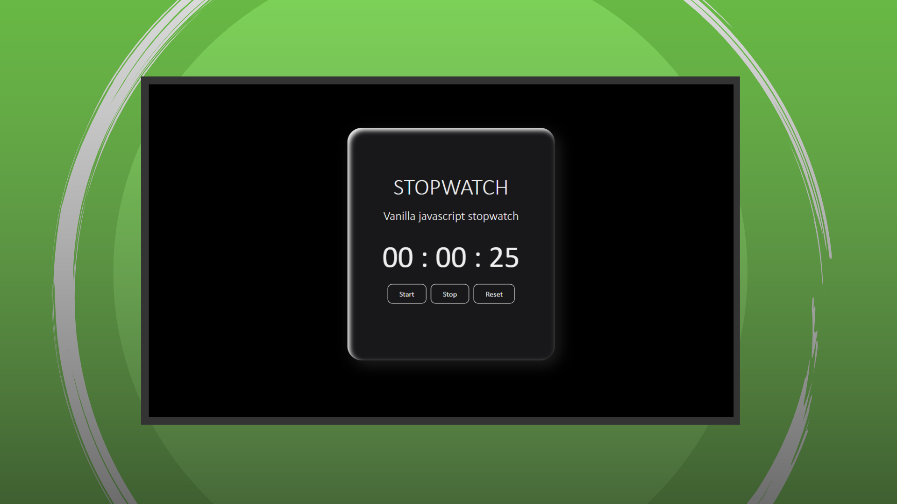

# my-vanilla-JS-projects

In this repo there is a complete list of vanilla javascript projects that are made entirely from scratch. In each file there will be a readme.md that gives a complete description on each individual project and how to use the project. Hope you enjoy.

## How To

- Step 1: Fork repository. Or skip to next step if you don't wish to clone this repository.
- Step 2: Create a new folder or place to store the clone repo.
- Step 3: In your VSCode open that folder and in the terminal type:

```
git clone https://github.com/Angeltheesoto/my-vanilla-JS-projects
```

- Step 3: In any project that you wish to run, go into the HTML file click anywhere in that html file and use the shorthand key [ ctrl + alt + n] for windows or [ cmd + alt + n] for mac to run the project in your web browser.

## Technologies

- HTML | CSS
- JavaScript
- Git | GitHub

## Display




